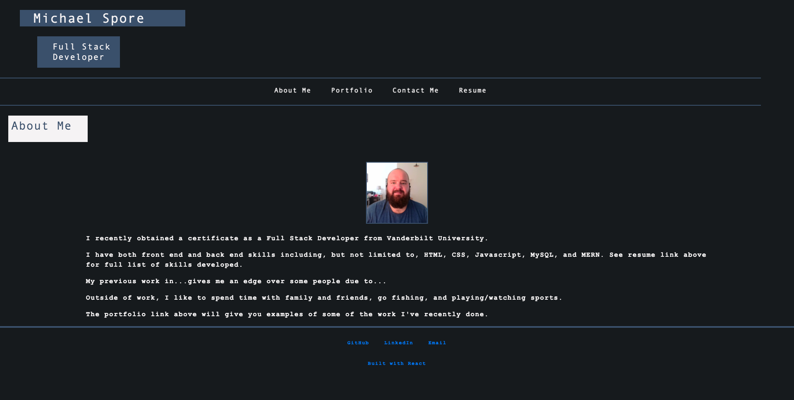

# Michael's React Portfolio

## Description

A portfolio of my projects built with React.

---

## Table of Contents

- [Website](#website)
- [Built With](#built-with)
- [Contributors](#contributors)
- [Acknowledgements](#acknowledgements)

---

## Website

https://spody10.github.io/ms-react-portfolio/

---

## Built With

[Back to Contents](#table-of-contents)

---

## Contributors

### Michael Spore

[Spody10](https://github.com/Spody10)

---

[Back to Contents](#table-of-contents)
